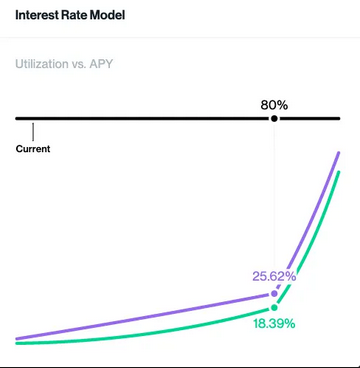

## 1. Overview
1.1. What is Ammalgam?  
1.2. Core Philosophy  
1.3. Problems in the DeFi ecosystem  
  • Reserve Imbalance During Market Stress  
1.4. What Makes Ammalgam Different (vs traditional DEXs/lending)  
1.5. Key Components:  
  • Exchange  
  • Recipes  
    • Payout charts  
    • Heat map  

## 2. Core Concepts

**1.1.** DP Pools (Lending + LPing in One)  
**1.2.** DLEX: Smart Order Routing & Execution  
**1.3.** AMMs, Orderbooks & Off-Chain Matching  
**1.4.** Risk Engine: Cross-Margining, Liquidation Logic  
- Slippage added to LTV   
  - NatSpec and Implementation  
  - Cost to liquidate X or Y

**1.5.** Funding Rate & No-Oracle Design   
- Price Ranges  
  - **Question:** Is a default of 1 week configuration for long term moving average long enough? Could it be shorter?   
- Tranche Tracking   
- Depleted Asset Protection   
## Approach 
- Allowing Deposits of Individual Assets for Lending and Collateral   
- Lending Limit Threshold   
- Three Tier Lending Utilization Rate Increase

**1.6.** Capital Efficiency & Slippage Mitigation  
**1.7.** Liquidations  
**1.8.** Interest Accrual  
**1.9.** Dynamic Swap Pricing   
### Other considerations   
- Mints and Deposits of depleted assets impacts to Dynamic Swap Price Calculations

## 3. Getting Started

**3.1.** Connecting a Wallet  
**3.2.** Navigating the UI  
**3.3.** Supported Networks  
**3.4.** Understanding the Dashboard  
**3.5.** Quick Start  

## 4. Strategies: The Recipe Menu

**4.1.** Composable Trading & Yield Strategies

- Strategy Types
  - Market Making  
  - Long / Short  
  - Leveraged Market Making  
  - Delta-Neutral Market Making  
  - Long/Short Market Making  
  - Straddles  
  - Calls / Puts  
  - Perpetuals  

#### ● How to Deploy a Recipe  
#### ● How to Customize / Create Your Own Strategy

# 1. Overview

## 1.1. What is Ammalgam?
Ammalgam introduces a new primitive in decentralized finance: the Decentralized Lending Exchange (DLEX). By combining trading and lending into a single protocol, DLEX unlocks a level of capital efficiency that traditional platforms can’t match, offering up to a 60% increase in yield for liquidity providers.

This architecture supports a wide range of strategies, from passive LP participation to highly customizable, advanced positions. Whether you’re looking for a set-and-forget yield experience or actively managing delta-neutral trades, Ammalgam offers the flexibility to do both without friction or fragmentation.

The protocol is fully autonomous, permissionless, and oracle-free. Ammalgam delivers a trustless, composable foundation for decentralized liquidity and lending at scale with no external dependencies and no centralized control.

## 1.2. Core Philosophy
At Ammalgam, our philosophy is to redefine how capital moves in decentralized finance. By fusing lending and trading into a single primitive, we enable liquidity to move more efficiently and strategies to evolve without barriers. We believe in a future where autonomy, permissionlessness, and composability are not features, but defaults. We built Ammalgam to remove friction, maximize opportunity, and create a financial system that operates without intermediaries, external dependencies, or centralized control.

## 1.3. Problems in the DeFi Ecosystem

### Capital is Fragmented Between Trading and Lending Protocols
Liquidity providers must choose between earning swap fees in AMMs or earning interest in lending platforms. Capital gets siloed, yield potential is limited, and users must actively manage assets across disconnected systems. Ammalgam unifies both functions within a single pool, removing the divide.

### Leveraged Strategies are Expensive and Complex
Market makers must borrow assets on one platform and deploy liquidity on another, incurring fees on both sides and taking on protocol bridging risk. Strategy execution becomes fragmented and capital inefficient. Ammalgam enables leveraged positions and borrowing directly in one pool.

### LP Returns are Constrained by Impermanent Loss and Split Yield
Traditional LPs risk impermanent loss and can only earn one type of yield at a time—either swap fees or lending interest, but not both. There’s no easy way to build delta-neutral or hedged exposure natively. Ammalgam allows LPs to access both yield streams and unlock new payoff structures.

### Reserve Imbalance During Market Stress
As asset prices shift, AMMs naturally rebalance token reserves. In extreme conditions like gamma squeezes or death spirals, one side of the pool can be depleted if loans on the appreciating asset aren’t repaid. Ammalgam uses a tiered protection system that intensifies during volatile markets and relaxes under normal conditions. Relying on dynamic lending limits, rising interest rates based on utilization, and adaptive swap pricing help prevent reserve exhaustion.

### Oracles Introduce Risk and Increase Surface Area for Exploits
Protocols rely on external price feeds, leaving them vulnerable to oracle manipulation, downtime, and liquidation errors—especially true in volatile markets. These dependencies can lead to systemic failures. Ammalgam eliminates this risk by using a fully on-chain, oracle-free design.

## 1.4. What Makes Ammalgam Different (vs Traditional DEXs/Lending)

### Unified Protocol Architecture
Ammalgam’s Decentralized Lending Exchange (DLEX) merges trading and lending into a single, seamless system. By consolidating core DeFi functions, Ammalgam removes the need for separate platforms, simplifying liquidity flows and making capital more efficient.

### Enhanced Capital Efficiency
Liquidity providers (LPs) earn from both swap fees and lending interest through a single position. The dual-earning model can drive up to a 20% increase in returns compared to traditional DeFi approaches, with assets working continuously across multiple revenue streams.

### Permissionless and Oracle-Free Design
Ammalgam operates without external price oracles or permissioned systems. By removing reliance on external inputs, the protocol reduces risks linked to oracle failures and centralized control points, creating a more autonomous, resilient financial layer.

### Advanced Strategy Support
Ammalgam’s architecture supports advanced trading strategies beyond passive yield generation, including delta-neutral positions, straddles, and leveraged market making. This flexibility opens the door for both sophisticated traders and passive LPs to optimize their returns based on individual risk preferences.

### User-Centric Visualization Tools
Ammalgam provides clear, intuitive visualization tools like payout charts and heat maps. These features help users better understand potential outcomes, assess risks, and make informed decisions as market conditions evolve.

## 1.5. Key Components

- **DLEX (Decentralized Lending Exchange)**

  The Decentralized Lending Exchange is Ammalgam’s core innovation. It fuses trading and lending into a single, unified protocol layer where both actions happen within the same pools. The DLEX creates a permissionless environment where capital operates at maximum efficiency so users don’t have to move across fragmented platforms.

- **Exchange**

  Ammalgam is a fork of Uniswap V2 but is designed to allow LP positions with payouts similar to concentrated liquidity and thus has parity with any DEX. Ammalgam uses leverage when creating concentrated liquidity-like positions so users need to monitor for liquidations; however, they are compensated by earning fees far beyond the similar range created when using concentrated liquidity. In essence, instead of monitoring ranges, LPs now focus on liquidations but benefit from increased fees and, consequently, higher yields.

- **Dual Purpose Pools (DP Pools)**

  DP Pools are the foundation of Ammalgam’s architecture, allowing liquidity to be used for both trading and lending within the same pool. Rather than split capital across protocols or choosing between yield types, LPs can deploy once and gain exposure to multiple sources of return. DP Pools also introduce a flexible structure that supports everything from passive liquidity provision to complex strategies like delta-neutral and leveraged positions—all within the Ammalgam protocol.

---

  

## Recipes
Ammalgam intends to democratize DeFi for retail investors. The UI is designed to show the impact of delta and gamma on any position simply and transparently. Ammalgam also provides a preset menu of strategies, called "recipes," for users:

- **Market Making** (descriptions of each to follow or be linked)
- **Short or Long**
- **Leveraged Market Making**
- **Delta Neutral Market Making**
- **Short or Long Market Making**
- **Straddles**
- **Calls or Puts**
- **Perpetuals**

   
- **Payout Charts**

Traders have historically relied on payout charts to determine the value of a position in relation to price movement. Ammalgam offers users instant access to assess the potential payout of a position as it relates to price fluctuations.

- **Heat Map**

Many correctly argue that passive LPs are adversely affected by V3, often due to the amplified effect of impermanent loss from the inherent leverage in concentrated liquidity. As payout charts remain static over time, these risks may not be immediately apparent to many retail traders. Ammalgam’s UI introduces a novel visualization tool that displays the impact of price fluctuations and the fees earned or incurred by LPs throughout the anticipated duration of their position. This tool clearly delineates the expected positive (green) or negative (red) portfolio values in relation to price changes at a future point in time.

  

---

## 2. Core Concepts

### 1.1. DP Pools (Lending + LPing in One)
Dual Purpose Pools (DP Pools) are a core feature of Ammalgam, combining Automated Market Making (AMM) and lending into one simple, unified system. Instead of separating trading and lending into different platforms, DP Pools let liquidity providers (LPs) earn both swap fees and lending interest at the same time, from the same deposit.

In most DeFi systems today, LPs have to split their capital to earn different types of yield. Market makers often borrow assets from lending protocols to leverage their liquidity positions, paying extra fees to a separate pool in the process - a problem known as “Split Fees.” Meanwhile, some AMMs lend out idle reserves to other platforms, causing parts of the pool to earn lending fees while others only earn trading fees - an inefficiency called “Split Capital.”

DP Pools solve both problems by letting every asset work on both sides at once. LPs don't need to move funds between protocols or choose between trading and lending returns. Market makers can borrow directly from the pools they help supply, paying only the spread between what they earn as lenders and what they pay as borrowers.This removes the need to interact with multiple protocols and reduces the overhead of running leveraged strategies.

This design unlocks a range of benefits for users:

- **Maximized Capital Efficiency:** Every asset earns trading and lending fees, keeping capital fully productive.
- **Simplified User Experience:** LPs can earn dual returns through a single, straightforward deposit.
- **Enhanced Yield Opportunities:** By stacking fee streams, LPs can achieve better returns without complex strategies.
- **Support for Advanced Strategies:** Sophisticated users can leverage DP Pools for delta-neutral positions, leveraged market making, and more.

By merging two core DeFi functions into a single layer, DP Pools make liquidity more efficient, more flexible, and more rewarding for everyone who participates.

### 1.2. DLEX: Smart Order Routing & Execution
The Decentralized Lending Exchange is at the core of Ammalgam’s execution and settlement architecture. It integrates AMM trading mechanics and lending functions within a unified liquidity layer.

DLEX governs the behavior of Dual Purpose Pools (DP Pools), coordinating swap execution, loan origination, and interest accrual without relying on external oracle feeds or fragmented liquidity sources. The Smart Order Routing engine inside DLEX automatically selects the most efficient execution path across DP Pools. By concentrating liquidity within multipurpose pools and minimizing fragmentation, DLEX significantly reduces routing overhead, increases capital inefficiency, and reduces price impact relative to traditional AMMs.

Legacy DeFi architectures treat trading and lending as isolated systems, requiring users to manually bridge between pools and protocols to achieve leveraged, hedged, or yield-optimized strategies.

DLEX combines trading and lending into a single execution layer, so capital can move more easily and strategies don’t have to be split across platforms.Users can combine or layer different financial strategies (e.g., lending, LPing, borrowing, hedging) within a single system.The absence of oracles or external data feeds keeps the system more secure, more efficient, and fully decentralized without giving up execution quality or lending flexibility.

When a trade is initiated, DLEX evaluates the pool’s current reserve balances, active borrow positions, and lending rates to execute the transaction in a manner that optimizes both swap pricing and capital deployment.

- Swaps are executed directly against DP Pools where the protocol dynamically adjusts internal accounting for both the trading and lending sides of the pool.
- Borrowers source liquidity from the same pools that provide trading depth, and DLEX ensures that borrowing rates and trading slippage adjust according to pool conditions in real time.

### 1.3. AMMs, Orderbooks & Off-Chain Matching
Ammalgam was forked from Uniswap V2 and has maintained the interface and utility of the Uniswap V2 Factory and Pair contract. The factory allows any two ERC-20 tokens to be grouped together to create a new Pair contract. The Pair allows for users to provide both assets in equal value to allow for traders to swap between the two assets in return for a small fee associated with each swap. Swaps are priced based on the invariant curve $X \cdot Y = K$ where the quantities of the two ERC-20 tokens in the pair are $X$ and $Y$ and $K$, sometimes known as the invariant, must have a starting value before the swap that is less than or equal to the value after the swap.

Our protocol into the Pair contract by adding methods to allow for depositing and borrowing of the two tokens $X$ and $Y$ as well as the ability to borrow market-making shares. The units of market making shares are tracked in units of $L$ which is equal to $\sqrt{K} = L$ for the value of $K$ associated with the individual deposit of $X$ and $Y$ rather than the values of the entire pool. Borrowed market maker liquidity is also tracked in units of $L$ but the underlying $X$ and $Y$ associated with the borrowed $L$ is what is transferred back to the users. Market making gives a portfolio payout with negative gamma often referred to as Impermanent Loss (IL). Borrowing market making liquidity gives users access to impairment gain.

### 1.4. Risk Engine: Cross-Margining, Liquidation Logic
Ammalgam’s Risk Engine secures the protocol through an integrated system of cross-margining, dynamic liquidation mechanics, and internal price safeguards.
Users can borrow across multiple collateral types - tokens ($X$, $Y$) and liquidity shares ($L$) - all managed within a single unified pool. Loans are validated against a Loan-to-Value (LTV) framework that continuously adjusts to each user’s position and the real-time conditions of the pools.

### Loan to Value
Each loan must be worth less than 75% of collateral provided to secure it, and often much less depending on the depth of liquidity with respect to the size of the loan. When borrowing one asset against the other, the calculation of loan to value (LTV) is as expected, $L_{TV} = \frac{Debt Value}{ Collateral Value}$. When we calculate the loan to value for market making positions, the calculation may not be as obvious. First we look at what we call $L_X$ and $L_Y$, the individual quantity of $X$ and $Y$ in the market making position and net it with the amount of $X$ and $Y$ deposited and borrowed. If the net of $X$ or $Y$ is negative, then that asset is treated as the debt and the other asset is treated as the collateral. We use the following equation to calculate LTV:

  

Each variable $X$, $Y$, $L_X$, & $L_Y$ can be negative or positive depending if it represents debt or collateral. If both $X + L_X < 0$ and $Y + L_Y < 0$, there is no collateral and the validation will fail and if both values are positive, there is no net debt and the validation of LTV passes.

### Slippage added to LTV
To deter large unsustainable loans, we consider slippage when calculating the LTV. To consider the slippage created when needing to liquidate collateral to repay the debt, we consider the amount of collateral needed to buy the requested debt using the current reserves. The needed collateral is then compared to the total collateral provided to ensure it fits within the allowed LTV. This will have a negligible impact on small loans concerning available liquidity and more restrictive for large loans. Flash loan manipulation attacks like C.R.E.A.M Finance and Mango become impossible when the slippage would require all the liquidity in the protocol pushing the LTV price from its high manipulated price back down to zero (the price required to buy all of the debt from the AMM to fund liquidation when the debt is the size of all of that asset in the AMM). Similar to Tranche Limitations, these limits could be expanded by the same configuration for more liquid trading pairs in which arbitrageurs can be assumed.

### NatSpec and Implementation

https://docs.ammalgam.xyz/docs/contracts/libraries/Validation.sol/library.Validation#increaseforslippage

### Cost to liquidate X or Y
https://www.desmos.com/calculator/v08sn8yn6r

  

---

## 1.5. Funding Rate & No-Oracle Design
Ammalgam operates without any dependence on other protocols or oracles. In order to facilitate lending, we must define the concept of price so that assets can be valued at for the purpose of properly comparing collateral securing them. There are three key components to our method of defining price:

1. Defining price as a range rather than a single value. The upper and lower bounds of this range serve as the basis for evaluating debts and collateral at the most unfavorable, restrictive price in the range.
2. Implementing outlier detection to limit the maximum and minimum allowable price deviations from the current price range within a block. This helps deter price manipulation attempts by increasing the associated costs.
3. Restricting positions based on the slippage required to liquidate the collateral to pay back the debt using the available liquidity in the pool.

The last restriction works well for individual positions, but does not stop someone from breaking up a single position that is too large for the available liquidity into multiple positions across multiple addresses that each individually meet the slippage requirements. For this we create tranches, or large ticks, across the entire price range that track each potential liquidation to ensure to limit the potential for cascading liquidations.

### Price Ranges 
This library tracks prices on a per-block basis by looking at the trading reserves at the start of each block. This provides three key metrics:

- the price at the end of the most recent block,
- the geometric mean price of the last 64 blocks,
- the geometric mean price over a longer-term period that can be configured.

The duration of this long-term period is flexible and can be configured to span a day, a week, or even a month but will start as 1 week. After deployment, before price windows are filled, pools can be swap-only. No borrowings until all windows are passed.

The minimum of all three prices is used to evaluate collateral value when a new position is opened. By taking the minimum and maximum values of these three prices, we establish the price range used within the protocol. The last block and mid term price would be used for the purpose of liquidations where the better price for the borrower would be used.

**Question:** Is a default of 1 week configuration for long term moving average long enough? Could it be shorter?

### Tranche Tracking
This work is still in progress. I began creating a detailed plan for its implementation when the idea of eliminating price-dependent liquidations diverted my focus.

### Depleted Asset Protection

https://docs.ammalgam.xyz/docs/design/depleted_asset_protection

## 1.6. Approach
To address these issues, Ammalgam has designed a tiered approach which intensifies to handle these death spirals as markets turn violent and subside during normal market conditions. There are 4 levels of protection against the impact of market death spirals:

- Allowing deposits of each asset individually to be lent out
- Lending limit threshold
- Three tier lending utilization rate increases
- Dynamic swap pricing

### Allowing Deposits of Individual Assets for Lending and Collateral
First, we have designed our contract to allow users to deposit assets XX and YY individually for the sole purpose of being lent out. Allowing deposits gives the market an additional way to respond by supplying liquidity as utilization peaks during bumpy market conditions. Since lending rates increase based on the percentage of assets lent out, high borrowing demand would spike interest rates as assets approach depletion. This encourages the market to respond by both supplying the asset as well as incentivize borrowers to repay their debts. This is a common approach that is sufficient in money market protocols and will be effective for the majority of market conditions.

### Lending Limit Threshold

If market conditions are not normal, lending rate increases may not be sufficient incentives to maintain sustainable reserves. The next protective measure will be a limit of what can be lent out. By only allowing 90% of assets to be borrowed, we create a buffer at which lending of the scarce asset stops and only swaps can utilize what remains. In our interest rate tier model, 90% lending utilization would correspond to 100% utilization in standard money market protocols. Under these conditions, lending rates would reach 40% annualized. This limit ensures that lending can not wipe out all of the liquidity and ensures that swaps can execute even if demand for borrowing assets in the pair contract has become aggressive.

### Three Tier Lending Utilization Rate Increase

If 40% yield rates are still not bringing liquidity back to the pair, the market is really starting to unwind. At this stage the FUD is catching on and there may even be enough market momentum to lead to cascading liquidations and forced selling. But, it’s probably too early to call it a death spiral. The protocol has already stopped borrowing for the scarce asset, but more trades are taking it than bringing it. As these trades continue to take out liquidity, we introduce a third interest rate tier. Money market protocols use a two tier model. The first slowly increases rates as borrow utilization goes from 0% to some sweet spot, typically 80%. After this, rates start to increase faster between the sweet spot and 100% utilization. Our third tier allows for a third, more aggressive, rate increase once a reserve’s health is at risk. Now each trade taking liquidity is noticeably raising interest rates further increasing the pain of borrowing and enticing what would be otherwise bystanders to jump in with liquidity to yield a high rate. Once rates surpass 100, 200, 500% annualized, it is hard to imagine the market not noticing and stepping in to relieve the pressure.

  

If this mechanism is still failing to stop the flow of liquidity out of the pair contract, the market is likely experiencing a death spiral. Interest rates might become completely meaningless. At this stage our mechanism design now needs to be ready for anything. The next response is designed to maintain sufficient liquidity to continue to fill swaps when no one is willing to provide liquidity or repay loans and the bountiful asset in the contract is going to zero and the market is violently trying to secure as much of the scarce asset as it can.

Some things that need to be considered here is that our tranche tracking assumes liquidity across unmodified curves. There are incentives in the depleted asset protection for anyone who is returning liquidity when the curve diverges down the modified path. The potential conflicts here are the incentives are ineffective and a number of liquidations or worse a cascade of liquidations become possible without sufficient liquidity to support them. 

---

## 1.6. Multi-Layered Protection Approach
Ammalgam maximizes capital efficiency by combining trading and lending within a unified AMM structure. It uses the constant product formula $X \times Y = K$, with liquidity tracked as $L = \sqrt{K}$.

Each asset serves as both trading liquidity and lending collateral, so liquidity providers can earn swap fees and lending interest from a single position. Borrowers draw capital directly from DP Pools with interest rates that adjust automatically based on real-time utilization.

Rates increase sharply as utilization rises. This encourages deleveraging and rebalancing before liquidity becomes critically low. If reserves drop too far, Ammalgam's Depleted Asset Protection adjusts the invariant curve to preserve swaps and allow the system to recover without external intervention.

Slippage mitigation is built into the lending process. Before approving any loan, the protocol calculates a Slippage-Adjusted Loan-to-Value (LTV) ratio. It estimates how much slippage would occur if the collateral had to be liquidated under current conditions. If the position would cause too much slippage or threaten reserve stability, the loan is blocked. Large positions are tracked across tranches to prevent over-concentration.

By embedding capital efficiency, slippage-aware risk checks, and liquidity protection into the core design, Ammalgam keeps assets productive, users protected, and the system resilient.

## 1.7. Liquidations

### Price Dependent Liquidations

The system will allow anyone to pay down a debt and receive the collateral plus some premium or discount depending on the price at any time. The initial price used will the mid term price or the geometric average price over the last 64 blocks and the last block price, whichever is better for the borrower. The price at which a liquidation will occur will include a premium or discount depending on where the liquidation price is with respect to the price at which a position crosses the allowed LTV. At the point at which the liquidation price pushes a debt to exceed the allowed LTV, there will be a small discount on the liquidation giving the user to close their position before the market has a chance to profit from the liquidation. As the price moves past this threshold of LTV, the discount will flip to a growing premium. This creates a similar effect to [Euler Finance’s Liquidations](https://docs.euler.finance/getting-started/white-paper#liquidations) that operate like a dutch auction.

By allowing liquidations to occur at any price, we ensure that a manipulation of a price will still lead liquidations to occur near the actual market and leave little to no benefit to an attacker. A counter example to demonstrate this point this, if we started the auction at some price and even included some discount, an attacker with sufficient capital could move the market to push a large position to be eligible for liquidation. If we include a discount on the premium to give the owner of the debt a chance to close their position, that discount could still be insufficient if the actual market price was less than the liquidation price including the discount. By making all positions eligible for liquidation with an increasing discount the further the price is away from the LTV threshold, we guarantee these liquidations will never occur at a manipulated inflated price giving an attacker an advantage.

There may be a way of not allowing liquidations unless a debt is beyond say 2/3 LTV and then letting the discount cross to premium for liquidators after crossing 3/4 LTV. It might be nice to give some guarantees to risk adverse borrowers that they can not be prematurely liquidated even if it would be to their benefit. The discount could start at 100% then move to say 10% at 75% LTV for example. I think the key here is to ensure the auction is both smooth block to block and effectively reaches a reasonable premium that results in a liquidation.

### Debt Cap Liquidations

Due to some of the design decisions taken to track debts in, it would be advantageous to bound debts from being able to grow past a certain point. Otherwise the increase in the size of a debt could result in a position needing to move from one tranche to another. Capping the debt by some bound allows each position to be fixed to one tranche, but requires the user to either pay down their debt as it approaches the cap, increase their cap in the current tranche if additional liquidity is available, or move to the next tranche. If a borrower neglects to manage their debt, a debt cap reduction liquidation would occur that would allow anyone to repay the debt down to the original debt size in exchange for an equal value of the users collateral plus some premium. The premium would increase the further the debt expanded beyond the bound. These liquidations can lead to full liquidations when there would be insufficient collateral left to secure the debt after the debt reduction liquidation.

---

## 1.8. Interest Accrual

In our original design, the relationship between where interest is accrued and where it is distributed is a bit tricky since market making liquidity can be borrowed and the individual assets are also lent out. This is because most of these individual assets are not used in an AMM with Uniswap V2 type liquidity. Here is a drawing showing where X, Y, and K are being borrowed from.

  

### Borrowed $X$ and $Y$

Borrowed $X$ and $Y$ are distributed pro rata between the depositors of $X$ and $K$ as well as $Y$ and $K$. Since the quantity of $X$ and $Y$ that make up $K$ fluctuates with the change of price, the geometric mean between state updates is used to determine how much was available of each to be borrowed between two given state updates. Using the geometric mean reduces the impact of outliers and thus minimizes the potency of someone trying to modify the price before a state update to earn a larger pro rata share of accrued interest.

### Borrowed $K$

When borrowing liquidity, first we consider the total deposited $K$, then subtract the borrowed $K$ to determine how much liquidity is active and available. It is important to note that the accounting for this borrowed liquidity is not done in units of $K$, but rather in liquidity, $L$, such that $L=\sqrt{K}$. The difference between total liquidity and the borrowed liquidity is called activeLiquidity. The active liquidity is what is available for both swaps, and to be borrowed individually in the form of $X$ and $Y$. This means that borrowed $X$ and $Y$ will eat into the available liquidity that can be borrowed in the form of $K$ and vice versa.

### Utilization based Rates

We use a slightly modified version of the two tier utilization model used by Compound and Aave. We want to emulate the sweet spot property of these models that lower lending rates prior to the sweet spot to encourage increased utilization and then increase aggressively after to encourage enough liquidity to allow for withdrawals. We add a third transition between when the max borrow is achieved at 90% utilization of $X$ and $Y$ and the depletion of asset that changes the invariant curve kick in at 95% utilization. This increases rates even faster to magnify incentivize to pay down debts or attract additional liquidity when an asset is depleted. See Three Tier Lending Utilization Rate Increase section of the depleted asset protection for more details.

If 40% yield rates are still not bringing liquidity back to the pair, the market is really starting to unwind. At this stage the FUD is catching on and there may even be enough market momentum to lead to cascading liquidations and forced selling. But, it’s probably too early to call it a death spiral. The protocol has already stopped borrowing for the scarce asset, but more trades are taking it than bringing it. As these trades continue to take out liquidity, we introduce a third interest rate tier. Money market protocols use a two tier model. The first slowly increases rates as borrow utilization goes from 0% to some sweet spot, typically 80%. After this, rates start to increase faster between the sweet spot and 100% utilization. Our third tier allows for a third, more aggressive, rate increase once a reserve’s health is at risk. Now each trade taking liquidity is noticeably raising interest rates further increasing the pain of borrowing and enticing what would be otherwise bystanders to jump in with liquidity to yield farm the high rate. Once rates surpass 100, 200, 500% annualized, it is hard imagine the market not noticing and stepping in to relieve the pressure.

  

Compounds two interest rate model

  

AMMalgam’s three tier model

If this mechanism is still failing to stop the flow of liquidity out of the pair contract, the market is likely experiencing a death spiral. Interest rates might become completely meaningless. At this stage our mechanism design now needs to be ready for anything. The next response is designed to maintain sufficient liquidity to continue to fill swaps when no one is willing to provide liquidity or repay loans and the bountiful asset in the contract is going to zero and the market is violently trying to secure as much of the scarce asset as it can.

---

## 1.9. Dynamic Swap Pricing
Once 90% of reserves have been lent out, Dynamic Swap Pricing will kick in to start to add a premium to trades taking the scarce liquidity and a discount for those bringing it. This essentially puts a throttle on swap transactions depleting the threatened assets. These adjustments start small and gradually increase as the health of the liquidity deteriorates. You can think of the adjustment to the invariant curves behavior similar to how Curve handles the depletion of assets as the stable invariant ($x+y = k$) as the pool becomes unbalanced.

During Dynamic Swap Pricing, instead of quoting trades using the invariant $K$ (calculated with the primary reserves in the contract and the lent out $X$ and $Y$) the calculation of the invariant would be adjusted to add a premium or discount to swaps. This premium would increase as the health of the reserves deplete. This can be achieved by modifying the inputs, $X$ and $Y$, prior to calculating $K$.

In the typical invariant $X \cdot Y = K$, As $X$ or $Y$ approaches zero, the cost to buy it goes up. In our case, we accelerate the rate at which $X$ or $Y$ approaches zero once only some some buffer (10%) of what should be there remains.

In the case that asset $X$ is depleting we modify the value being used in $X\cdot Y=K$. Let $X$ be the virtual reserves, the quantity that would be in the pool if there was nothing being lent. Let $X_M$ be the quality of the asset that is missing due to lending. Let B be the buffer (90%) of assets remaining of $X$, and $X_A$ be the adjusted value of $X$ passed to our invariant function $X \cdot Y=K$ .

  

To show this by example take a look at the Desmos chart showing $Y \cdot X_A = k$ in green.

  

Test it out yourself at https://www.desmos.com/calculator/21q6lgnqco

This essentially creates a premium for the asset that is depleting. There is no quantity of $X$ or $Y$ that could be swapped to take all of the liquidity out of the contract. Similarly, a discount is given to swaps that bring in the asset that is at risk of being depleted by reversing the order of the calculations.

With Dynamic Swap Pricing, backup reserves can never be completely depleted without the rate of exchange effectively reaching 0 or $\infty$.

To see what this would look like in practice, let’s consider the [ETH-USDC Uniswap v2 pair contract](https://etherscan.io/address/0xB4e16d0168e52d35CaCD2c6185b44281Ec28C9Dc). At time of writing it held 59,589,000 USDC and 36,852 ETH. Consider the case where 90% of ETH has been lent out.

Traders will not make these trades unless the swap with the premium is at or below the external market rate. As such, Swap sizes and volume will likely be far lower than that of our competitors when reserve health is low. But the goal in a death spiral is not to have the highest swap volume, it’s to have protect our novel financial primitive from exploding. It is hard to imagine a market scenario that could sustain the deteriorated state of the reserves for an extended period of time. The outstanding loan principal of the scarce asset would be both appreciating in value and costing double and triple percentages annualized. At the same time, the collateral would be depreciating. Loans would be forced to be repaid or liquidated. All of these factors persisting long term, although possible, don’t seem probable. But if crypto has taught us anything, the most unimaginably strange things can occur in the market. If the unimaginable did occur, this design would still still be able to fill swaps, even when -j order book became a ghost town and the Uniswap V3 pair got stuck.

---

### Other Considerations
Mints and Deposits of depleted assets impacts to Dynamic Swap Price Calculations

When depleted assets are restored by deposits and mints, the user bringing the assets can earn additional deposits by taking advantage of to the premium from the swap discount when providing a scarce asset. In the case of a deposit, rather than depositing the assets, a user could first swap some of the assets they intend to deposit to lessen the divergence the unmodified invariant, then deposit, then take the proceeds from the first swap, swap back at a lower premium then the discount from the first swap. This same case applies to mints. Instead of requiring the users to perform multiple swaps, we can modify the mint and deposit methods to perform the same behavior.

---

# 3. Getting Started

## 3.1. Connecting a Wallet

To begin using Ammalgam, visit https://beta.ammalgam.xyz/ and connect your wallet by clicking on the Connect Wallet button in the top right. You can use MetaMask or any supported browser wallet. Ensure your wallet is set to one of the supported test networks.

## 3.2. Navigating the UI

The interface is organized into three main tabs:

- **Pools** – Lend and earn yield
- **Trade** – Open long or short positions, or swap tokens
- **DLEX** – Configure advanced strategy recipes with visual tools

The layout is designed for both passive users and advanced traders, giving everyone access to capital-efficient DeFi.

## 3.3. Supported Networks

During the beta, Ammalgam is available on the following networks:

- Sepolia
- Arbitrum Sepolia
- Monad Testnet
- Botanix Testnet

Switch networks from the top-right dropdown menu in the app.

## 3.4. Understanding the Dashboard

Once you connect your wallet, you'll access the Pools dashboard where you can access:

- Top liquidity pairs (e.g. DAI/USDC, USDC/WBTC)
- TVL (Total Value Locked)
- APY (Annual Percentage Yield) for each token

You can also:

- Claim test tokens via the Faucet
- View current strategy performance in the DLEX tab

## 3.5. Quick Start:

### Trade

Use the **Trade** tab to:

- Swap assets
- Open leveraged **Long** or **Short** positions

Select the tokens you want to trade, set the amount, and approve the transaction from your wallet.

### Deposit

Go to the Pools tab and select a liquidity pair. Choose which asset to deposit, approve the transaction, and confirm it from your wallet. Your deposited funds start earning yield immediately.

### Lend

Depositing into a pool simultaneously lends your assets. You earn interest from borrowers and trading fees from swaps.

As soon as you confirm your deposit, you start earning a yield. You can close your position and withdraw funds to your connected wallet.

### Borrow

Visit the Trade tab and choose Long or Short to initiate a borrow. Your existing deposits will be used as collateral. Margin and liquidation risk are automatically managed by the protocol.

### Try a Recipe

You can explore the available recipes from the DLEX tab:

- Select a pair and choose a strategy (e.g. Market Making, Straddle)
- Adjust parameters like exposure % and delta/gamma scores
- Preview outcomes via a live payout chart and heat map

You can monitor or exit recipe-based strategies from the pool interface from the **View Pool** button at the bottom.

# 4. Strategies: The Recipe Menu

Ammalgam’s DeFi-native “Preset Plays” built for users

## 4.1. Composable Trading & Yield Strategies

### Strategy Types

- **Market Making**  
  - **Long / Short**  
  - **Leveraged Market Making**  
  - **Delta-Neutral Market Making**  
  - **Long/Short Market Making**  
  - **Straddles**  
  - **Calls / Puts**  
  - **Perpetuals**

### How to Deploy a Recipe

### How to Customize / Create Your Own Strategy
