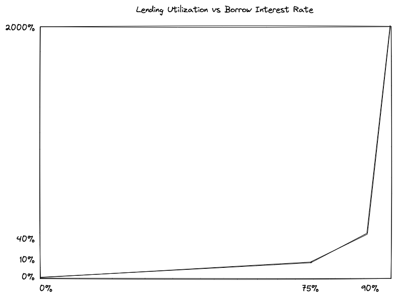

# Depleted Asset Protection

## Problem Description

Ammalgam is an automated market maker that lends out unutilized assets. As prices change, the amount of each asset in the contract changes. The asset increasing in value decreases in quantity as the asset decreasing in value increases in quantity. At some point the AMM could exhaust reserves of one asset if loans are not repaid or there are not enough people willing to supply the appreciating asset. This situation is most likely to occur in a market condition known as a *gamma squeeze* where the appreciating asset was previously heavily borrowed or shorted. Those ‘squeezed’ debts then start to balloon leading to forced selling of the depreciating asset that is being used as collateral. Some examples of this gamma squeeze include (1) in May 2022 when UST lost its peg to the dollar and firms like Three Arrows had used leverage to multiply the return on their deposits of UST into Anchor and (2) when retail traders worked together to purchase GameStop to force large trading firms with shorts on the stock to close their positions at a substantial loss. Gamma squeezes can also be referred to as death spirals as the forced trades can create a feedback loop further escalating the trade momentum resulting in violent price changes.

Below are some examples of how the UST de-pegging exhausted reserves on Uniswap V3 UST/USDC pool and emptied the Binance UST/USDT book. These are shared to point out that this condition is not unique to Ammalgam’s design, but has happened in other DeFi protocols and centralized exchanges. For Ammalgam, it is critical to know what the market thinks each asset is worth at all times in order to appropriately value collateral for outstanding loans.

<blockquote class="twitter-tweet">
1/ Fascinating little phenomenon happening in the Uniswap UST/USDC pool right now... The price in the pool is basically &quot;stuck&quot; at $0.952, despite the actual market price being $0.93. <a href="https://t.co/i6MQW7ubTd">pic.twitter.com/i6MQW7ubTd</a>
&mdash; Doug Colkitt (@0xdoug) <a href="https://twitter.com/0xdoug/status/1523782169276997633?ref_src=twsrc%5Etfw">May 9, 2022</a></blockquote> 

<blockquote class="twitter-tweet">
Binance book is empty. Never seen that before <a href="https://t.co/ez4ZZT9sDR">pic.twitter.com/ez4ZZT9sDR</a>
&mdash; Hasu⚡️🤖 (@hasufl) <a href="https://twitter.com/hasufl/status/1523817151471230976?ref_src=twsrc%5Etfw">May 10, 2022</a></blockquote> 

## Approach

To address these issues, Ammalgam has designed a tiered approach which intensifies to handle these death spirals as markets turn violent and subside during normal market conditions.  There are 4 levels of protection against the impact of market death spirals:

- Allowing deposits of each assets individually to be lent out
- Lending limit threshold
- Three tier lending utilization rate increases
- Dynamic swap pricing

### Allowing Deposits of Individual Assets for Lending and Collateral

First, we have designed our contract to allow users to deposit assets $X$ and $Y$ individually for the sole purpose of being lent out. Allowing deposits gives the market an additional way to respond by supplying liquidity as utilization peaks during bumpy market conditions. Since lending rates increase based on the percentage of assets lent out, high borrowing demand would spike interest rates as an assets approach depletion. This encourages the market to respond by both supplying the asset as well as incentivize borrowers to repay their debts. This is a common approach that is sufficient in money market protocols and will be effective for the majority of market conditions.

### Lending Limit Threshold

If markets conditions are not normal, lending rate increases may not be sufficient incentives to maintain sustainable reserves. The next protective measure will be a limit of what can be lent out. By only allowing 90% of assets to be borrowed, we create a buffer at which lending of the scarce asset stops and only swaps can utilize what remains. In our interest rate tier model, 90% lending utilization would correspond to 100% utilization in standard money market protocols. Under these conditions, lending rates would reach 40% annualized. This limit ensures that lending can not wipe out all of the liquidity and ensure that swaps can execute even if demand for borrowing assets in the pair contract have become aggressive. 

### Three Tier Lending Utilization Rate Increase

If 40% yield rates are still not bringing liquidity back to the pair, the market is really starting to unwind. At this stage the FUD is catching on and there may even be enough market momentum to lead to cascading liquidations and forced selling. But, it’s probably too early to call it a death spiral. The protocol has already stopped borrowing for the scarce asset, but more trades are taking it than bringing it. As these trades continue to take out liquidity, we introduce a third interest rate tier. Money market protocols use a two tier model. The first slowly increases rates as borrow utilization goes from 0% to some sweet spot, typically 80%. After this, rates start to increase faster between the sweet spot and 100% utilization. Our third tier allows for a third, more aggressive, rate increase once a reserve’s health is at risk. Now each trade taking liquidity is noticeably raising interest rates further increasing the pain of borrowing and enticing what would be otherwise bystanders to jump in with liquidity to yield farm the high rate. Once rates surpass 100, 200, 500% annualized, it is hard imagine the market not noticing and stepping in to relieve the pressure.

If this mechanism is still failing to stop the flow of liquidity out of the pair contract, the market is likely experiencing a death spiral. Interest rates might become completely meaningless. At this stage our mechanism design now needs to be ready for anything. The next response is designed to maintain sufficient liquidity to continue to fill swaps when no one is willing to provide liquidity or repay loans and the bountiful asset in the contract is going to zero and the market is violently trying to secure as much of the scarce asset as it can. 

### Dynamic Swap Pricing
 
<iframe src="https://www.desmos.com/calculator/btodxumiqu?embed" frameborder="0" allowfullscreen width="100%" height="600"></iframe>

