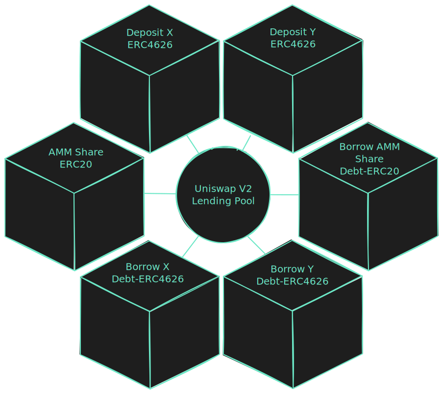

# Architecture Overview

## Forking Uniswap V2

We began development of Ammalgam by forking the Uniswap V2 contracts with the goal of building a lending protocol into the Uniswap V2 pair contract. We were unable to maintain the single contract of the Uniswap v2 Pair due to the need for multiple ERC-20s for various added deposit borrow tokens. The factory remains the same in purpose, but some changes to the process of deploying a new pair due to the need to deploy multiple contracts for each new pair.

## Pair contracts

The pair contracts have been split into seven contracts. The exterior contracts create six tokens representing the six functions of Ammalgam.

The Uniswap V2 Pair was itself an ERC-20 representing the share of swap liquidity a user deposited into the pair. Due to code size space constraints, we had to move as much logic out ot the original Pair contract which included the ERC-20 representing swap liquidity. Users can also deposit asset X or Y individually to be used as collateral and to be lent out to earn yield, but not to be used to fill swaps or earn swap fees. When borrowing X, Y, or swap liquidity (L) a transferrable debt token is issued to borrowers. We use the ERC-4626 vault standard to represent deposits and debts, but only use the ERC-20 for swap liquidity due to the fact that there are two underlying assets with a variable share to asset rate depending on price. 

The interior contract, labeled in our diagram Uniswap V2 Lending Pool, contains most of the initial [IUniswapV2](https://github.com/Uniswap/v2-core/blob/master/contracts/interfaces/IUniswapV2Pair.sol) interface except for those functions associated with the IERC20 that were moved. Additionally lending functions and libraries where added 
