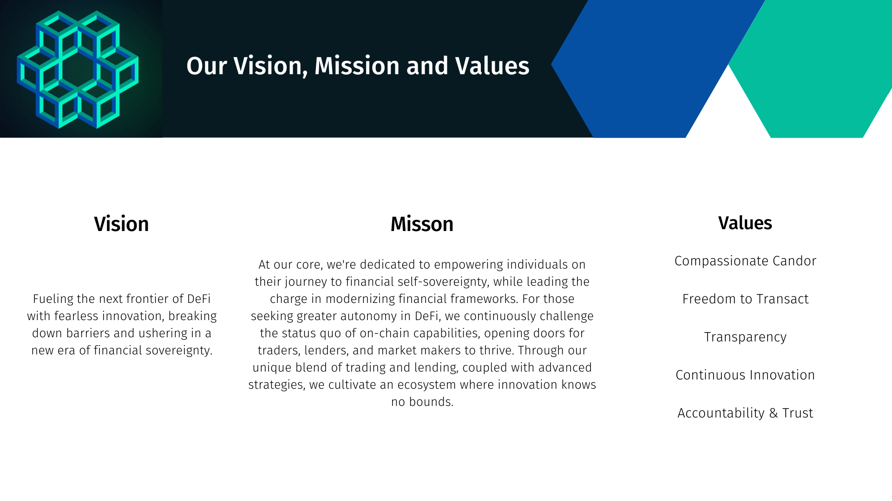

# April 2024

## tl;dr

- Interviewing a number of folks for the Front-end devs to help maintain
  momentum after pushing most of the current team to the contract side.
- Contract work is the main priority and the resources and attention have been
  focused to execute.
- Planning to announce the raise once we are in audits.
- Built content calendar for social to help build organic socials growth.
- Defined Ammalgam's Vision, Mission, and Values.

## Development

### Hiring

We have been actively interviewing candidates, thank you to anyone who connected
us with candidates or shared recruiting resources. While we max out our
engineering resources to complete the contract code, new hires will onboard to
the front end and allow us to maintain momentum in the short term and later
accelerate our velocity once the contracts are in audits.

### Contracts

Last month we hired a new Solidity engineer and are giving two Front-end
engineers contracts work. A lot of work went into levelling up our Front-end
engineers and new hire to understand and contribute to our contracts and those
efforts are starting to manifest in improvements to our velocity.

To give a bit more context, we have three remaining items to wrap up:

- Interest accrual
- Cascading liquidation protections
- Liquidations

At the start of last month, interest accrual was the only item getting
attention. Now we have a plan to tackle all three with the larger team. Our
forth contract engineer had been working on the front end, but is now working on
cleaning up some issues that came to light when we did a white paper audit with
ChainSecurity in February.

While we were raising, I was not able to do as good of a job supporting the
engineering team. I have the master plan in my head and often times the hardest
work I have to do it break it down for everyone else in a comprehensible way. As
I spent more time focusing on raising funds, more pressure fell on team members
to figure things out on their own and this wasn't always as optimal as when I
was able to be more available.

The good news I was able to engage with engineering this month. We continue to
asses our progress and are maintaining communication with auditors about our
anticipated completion and their calendars. We are currently slotted to start
audits at the end of June. There is a strong sense of urgency to deliver
throughout the team. We all feel it. We also have to balance that urgency with
uncompromising quality standards and properly managing complexity. We need this
product to be auditable and safe, these things take time especially due to the
complexity that we are working with.

## Raise Announcement

Announcing this round will be an attention grabber and we want to use this
wisely. Once we are in audits we will have eliminated most of the development
execution risks. Announcing before those risks are mediated means that we could
generate attention and then we may struggle to maintain it. Thank you for
everyone who has reached out to offer exposure in anyway, we will take you up on
all of it once we are in audits. In the meantime, we want to focus on getting
through the last bits of code we need to wrap this up.

## Business & GTM

While we are grinding on the development, we are also working to build some
organic momentum on socials.

- We developed a content calendar focused on highlighting Ammalgam’s competitive
  differentiators (capital efficiency, long / short on-chain, advanced market
  making strategies, no oracle for increased autonomy, etc.) and are automating
  Ammalgam’s Twitter account to ensure we are consistently increasing social
  media activity.
- We have also developed content and will be launching a “Building in Public”
  campaign that orchestrates the Ammalgam team’s social accounts, AMAs and
  Twitter Spaces. Please let us know if you are interested in participating in
  AMAs or Spaces with Ammalgam.
- We have defined Ammalgam’s Mission, Vision, and Values.

- Since our last update, we met with Arbitrum, Bera Chain, and Mode (Manta
  soon). We are actively considering other chains as well, but also pausing this
  outreach until we are in audits.

### **“Attention” Campaign**

- We have initiated discussions with Web 3.0 marketing agencies in preparation
  for Ammalgam’s go to market campaign.
- We are considering a preliminary incentives campaign.
- We are exploring additional strategies at the intersection of hype generation,
  community building, and degen culture to optimize engagement and find sticky
  users with mutually aligned interests:
  - We have completed research on other protocols with successful campaigns.
  - We will launch quests this month while we continue exploring more
    extensive ground-up community building efforts

Our goal is to define all aspects of the attention / hype campaign by end of May
so we can launch the campaign in June.
