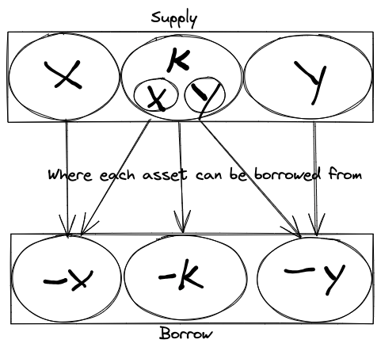

# June 2024

## tl;dr

- Still building in public, come check it out.
- So close to audits, but still navigating the last bits of complexity.

## Development

The team is really kicking into high gear and we continue to make progress
coding and refining the outstanding work. Every month we have a clearer picture
of what is left to do, and it is so close we think we can grab it. It has been a
tendency of ours to underestimate the complexity of what we are building, but we
are running out of things we need to do. Some of the team has been working to
clean up loose ends in preparation for starting audits. I am completely
confident that we have built the team we need and continue to solve the problems
we need to solve to finish strong. We continue to build in public and have
bi-weekly reviews of what we are working on open to anyone in Discord.

[Discord Invite link](https://discord.com/invite/QJTyB5PAXw)

[Bi-weekly Review](https://discord.com/events/969431939289350177/1256268914934026298)

This month we will be focusing on finalizing the details and grooming risk
saturation protection and liquidation work. We have had a rough plan for this
for a while, but the more detailed the plan became, the more thought was
required about how to do it in an optimal manner. We need the code to run in
constant time, we need it to not be overly restrictive, and we need it to
protect against cascading liquidations. I have sought out feedback in the past
from some of the more technically savvy investors and had our plan audited with
ChainSecurity to make sure we were covering all the bases. The engineer we hired
in March has taken the rough plan I had outlined and has been filling in the
details and working out the kinks. This has been a huge relief as I am no longer
the only person thinking about it. We are very close to having the final details
on this completely worked out and I believe the implementation should be the
easy part once the plan has been finalized.

Interest rate work should also be completed. This was also something that I
thought was going to be much simpler to implement than it has been. The
relationships between the things that can be borrowed, X, Y, and L, and how that
interest rolls up to the suppliers was not simple at all. We have worked out the
worst parts of this. All of the interest and trading fees that roll up to market
makers has been worked out and majority of it coded. The last bit is just coding
the part where suppliers of individual assets earn interest from the borrowed
assets. I think we can wrap that up this month and release new versions of the
contracts on testnet with the added behavior.

## Go to Market

We have received lots of positive feedback on the GTM strategy we outlined for
Ammalgam and continue to iterate, remain agile, and improve the plan while
initiating the ground-work necessary to launch the campaign when ready. We
reflected on what we thought the team was still missing and are close to
fleshing out the core marketing / business team. This is a rather short update
given the team just returned from EthCC. We look forward to a more meaningful
update next month. Once we are code complete and in audits, things will start
moving very quickly on the go-to-market front. Right now, the team is deep in
planning and focused on laying the groundwork on content, community,
collaboration, etc. so when we hit "Go", we've got jacks or better.
