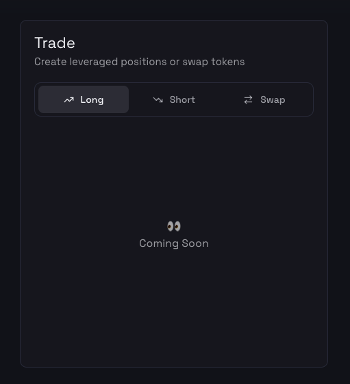
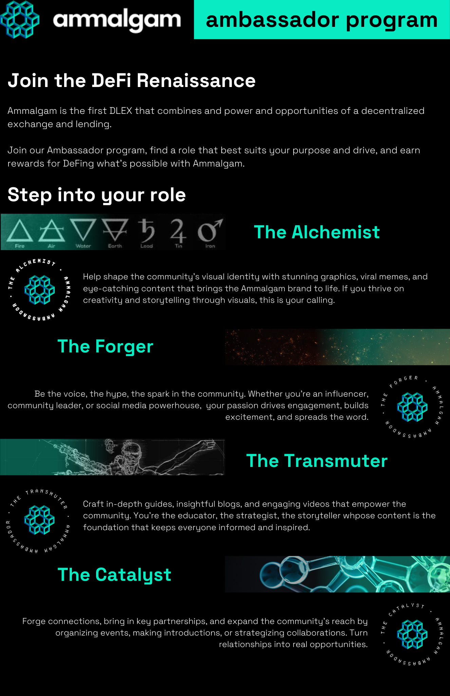

# January

## tl;dr

- Engineering on track for End of March launch
- First audit to conclude by the end of this February, second audit second week of March
- [EthDenver Go-Kart Event](https://lu.ma/zt07l6tp) (already 350 signups)
- EthDenver sponsorship
- Monad & Botanix [Testnet release live](https://alpha.ammalgam.xyz) (invite code `update`)
- Launched [new site](https://www.notion.so/January-2025-Update-1923195c2bf5805b9e2bf09aa68e1ead?pvs=21)

## Development

We are finally able to start rolling out tangible results from development and it is starting to get
exciting. Now with firm end dates for the audits, we are able to execute faster on wrapping up the
final loose ends on the front end. We are close to rolling out our limitless long and short
features, I anticipate we should have it released before or during EthDenver.

We are very excited to be using EthDenver to inspire builders to build on top of what we created. 3
years ago before we had officially started Ammalgam, I participated in the hackathon and met our
main engineer we have working with us today. This is one of the best places I have seen across all
conferences to bump into emerging web3 engineers and we hired our second contract engineer at
EthDenver last year. We truly have gotten a ton out of this conference and I am excited to sponsor
the conference. This is not something we have spend money on the past, but this is a critical time
for us to be building awareness as we prepare to launch our product.

Our next task is to stabilize the front end and peripheral contracts to support the various
restrictions imposed by the core contracts to keep assets safe. There is some calculations that we
need to reimplement on the front end in order to know how much users can borrow based on the
conditions in the pair.

## Marketing

- Scaling the marketing team
- Launched new site with updated branding and positioning
- Launched new social strategy and post schedule (from 1-2 to 4-5 posts weekly)
- Key testnet partnerships with Monad, Botanix
- Relaunch Ambassador program and added 76 ambassadors (as of 10, Feb)

### GTM

- ETHDenver sponsorship (Meta)
  - Ammalgam #BUIDLATHON Bounties
  - GoKart/Axe Throwing side event with Botanix
  - Sponsor session: Diving Into Shallow Markets: Why Liquidity Depth Matters Less Than You Think
- Pending audit announcement/press
