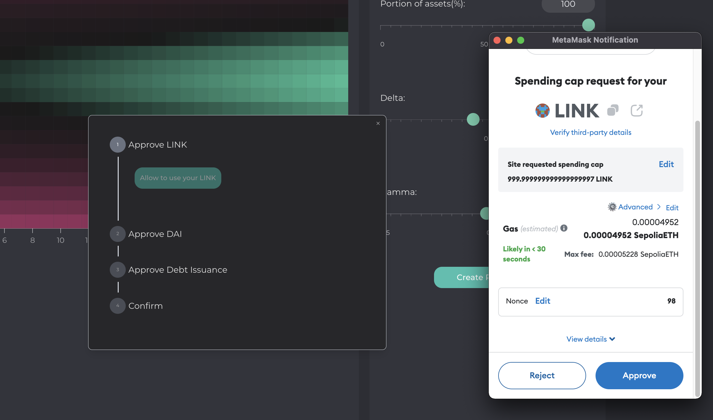

# November 2023

## TL;DR

- We spiffed up and are planning on publicly announcing our [docs](https://docs.ammalgam.xyz) next week.
- [Landing page](https://ammalgam) update in time for documentation announcement.
- We are targeting publicly sharing and announcing  our [dApp](https://ammalgam.vercel.app/) before the end of the year.
- Added ERC-4626 interface to our tokens, a first step in adding interest rate logic.
- Slow fundraising allowed me to dive into the code and making a huge dent in wrapping up no oracle work.
- We are following advisement from our lawyers to set up a legal entity in the Cayman Islands.

## Development

### Contracts

Since fundraising conversations have slowed down, I have been able to refocus on wrapping up some of the more technical components of our no oracle work. I had originally looked at the TickMath Library from Uniswap V3 and thought we could refactor it to our needs by changing one line of code. Unfortunately, I was way off. I ended up having to do a bit of a deep dive to fully grok the logic, reviewing auditor write ups like this one from ABDK on [Logarithm-Approximation-Precision](https://hackmd.io/@abdk/SkVJeHK9v#Logarithm-Approximation-Precision). I am on the other side of it now and close to opening a pull request that will give me a much needed tool to proceed with the Tranche work. Here is a rough draft of a [write up of my findings](https://www.notion.so/Generalization-of-Binary-Logarithm-Adjustments-569ae68b2b1b41b8be9f13a72373483b?pvs=21). 

We also introduced the [ERC-4626](https://ethereum.org/en/developers/docs/standards/tokens/erc-4626/) interface that will be important to allow for easy integrations with lending aggregators and also introduces the concept of shares and assets which is crucial for accruing interests. 

### Docs

Last month I got a rough outline of our docs up on our website. This month we added styling, refined the content, and added our contract documentation. Contract documentation allow you to see each contract and all of its functions and events along with the documentation for that function.

### Interface

We want to release the dApp by the end of the year. So we made a priority list and picked the top items we thought we could deliver on. The Pair overview page will get a light touch for most, if not all, of the attributes on the wire frame below. This should help to make if feel a bit more like Aave and Compound and give users quick access to accomplish simple tasks.

The second goal is to add helper text throughout the app to help give users an easy way to learn more about what things are, what they do, and what they mean. 

The last goal is to rename a few things in the dApp to try to be more consistent with other dApps. One example is that we interchange the words Pool and Pair a lot and it can be confusing. So this is really an exercise to help the average degen feel at home and make sure we are using consistent language with dApps with which we offer feature parity. 

This last month, we spent a lot of time trying to improve the UX experience for
submitting transactions that require multiple approvals. The Advanced Pool page
already is complete, and the close position is almost complete. This effort also
introduced some modernization by leaning on [Shadcn](https://ui.shadcn.com/) and
[Tailwinds](https://tailwindcss.com/). Our front-end engineers advocate for
modernizing libraries. We will continue to migrate to these libraries as we
touch different pieces of the app.

